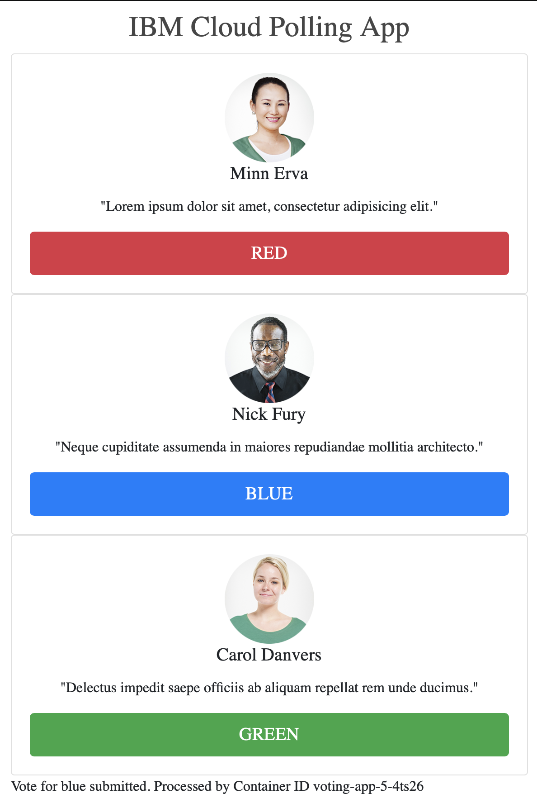

## sample-voting-app

React Web project with ExpressJS on NodeJS. This sample voting app is stateless and can be modified to use a backing service e.g. a [Node-Red dashboard](https://flows.nodered.org/node/node-red-dashboard) application to store and display the vote data. You can run it locally on your development workstation or deploy it onto a Kubernetes container environment like [Red Hat OpenShift on IBM Cloud](https://cloud.ibm.com/kubernetes/catalog/openshiftcluster).

[](https://bluemix.net)


### Table of Contents
* [Summary](#summary)
* [Deploy to your Development Workstation](#local)
* [Deploy to Red Hat OpenShift on IBM Cloud](#cloud)
* [References](#references)


<a name="summary"></a>
### Summary
The React web starter contains an opinionated set of components for modern web development, including:

* [React](https://facebook.github.io/react/)
* [Webpack](https://webpack.github.io/)
* [Sass](http://sass-lang.com/) 
* [Babel](https://babeljs.io/) for ECMAScript 2015 (ES2015) 
* [gulp](http://gulpjs.com/)

React is a framework for creating user interfaces in modular components.

You can deploy the application [locally to your development workstation](#local) or to a [Red Hat OpenShift on IBM Cloud cluster](#cloud).

<a name="local"></a>
### Local
### Deploy to your Development Workstation

- Install the latest [NodeJS](https://nodejs.org/en/download/) 6+ LTS version.
- Clone this repository to your development workstation: `git clone https://github.com/kkkum/sample-voting-app.git`
- Change to the local project directory: `cd sample-voting-app`
- Start the application: `npm run start`
- Use a browser to access your application running at `http://localhost:3000` on your local workstation

<a name="cloud"></a>
### Cloud
### Deploy to Red Hat OpenShift on IBM Cloud

1. Create a Red Hat OpenShift cluster by following [Lesson 1 of the Tutorial: Creating a Red Hat OpenShift on IBM Cloud](https://cloud.ibm.com/docs/openshift?topic=openshift-openshift_tutorial#openshift_create_cluster)

2. [Access the OpenShift Web Console](https://cloud.ibm.com/docs/openshift?topic=openshift-openshift_tutorial#openshift_oc_console) of the OpenShift cluster you have created. Paste the `oc login` command copied from the OpenShift Web Console into a terminal on your development workstation to authenticate via the CLI.

3. After the successful execution of the `oc login` command on your terminal, create a project for your voting application. For example:
    ```shell
    oc new-project blue-demo
    ```
    The command above creates a project named `blue-demo` in your OpenShift cluster.

4. In the terminal, use the CLI to create your voting application using the web URL of this git repository. For example:
    ```shell
    oc new-app --name=voting-app https://github.com/kkkum/sample-voting-app
    ```
    The command above creates the sample voting application in your project named `voting-app`.

5. Monitor the build process using the OpenShift web console or using the `oc logs` command:
    ```shell
    oc logs -f bc/voting-app
    ```
    The command above streams the log output of build process of the app named `voting-app`. When completed, you can type `Ctrl-c` to return to the command line.

6. Verify the voting-app components are created.

    * Use the `oc get pods` command to get the list of application pods in the current project `blue-demo`:
    ```shell
    oc get po -n blue-demo
    ```
    
    * Use the `oc get svc` command to get the list of services in the current project `blue-demo`:
    ```shell
    oc get svc -n blue-demo
    ```
    You will see a service named `voting-app`.

5. Set up a route so that you can publicly access the voting-app service using the `oc create route` command in the current project `blue-demo`:
    ```shell
    oc create route edge --service=voting-app -n blue-demo
    ```

6. Get the route hostname address from the Host/Port output of the `oc get route` command in the current project `blue-demo`:
    ```shell
    oc get route -n blue-demo
    ```

7. Open a browser to access the voting-app with the route hostname address created. Be sure to precede your route hostname with `https://`. The app page will appear as follows:

    

<a name="references"></a>
## References

1. [Tutorial: Creating a Red Hat OpenShift on IBM Cloud cluster](https://cloud.ibm.com/docs/openshift?topic=openshift-openshift_tutorial)

2. [A sample Node React application for IBM Cloud](https://github.com/IBM/nodejs-react-app)

3. [Red Hat OpenShift on IBM Cloud](https://www.ibm.com/cloud/openshift)

4. [Kubernetes Documentation](https://kubernetes.io/docs/home/)

